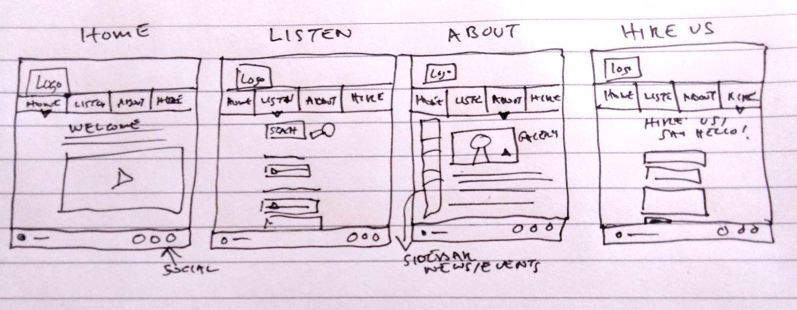
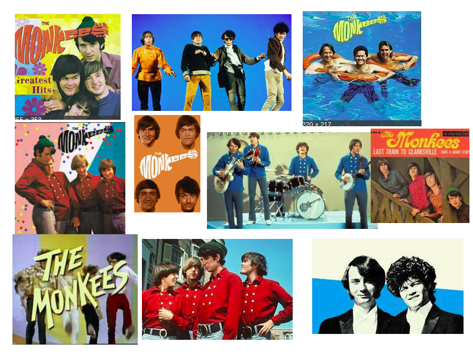

# CREATE A WEBSITE FOR A BAND

Build a static (front-end only) website for a band. As a starting point, you may want to use wireframes, as we did in the UX lesson (you can use Balsamiq or any other tool, including just pen and paper). You can use either your assets or the assets within the following GitHub repo.

The band is a 1960’s rock band and have around 50 years experience of performing live at numerous events around the world. You have been given the following requirements after interviews with the client’s representatives:
- Their primary target audiences are their fans and potential fans who wish to use the site to see and hear clips from their back catalog, and any new material as it becomes available.
- Also, the band would like to use the site to showcase their music and publicise their availability to perform at events such as weddings and Christmas parties.

The band has provided you, the developer, with the following assets that they would like to showcase on their website:
- Photos of the band members
- A video clip
- Audio clips

Also, they are in the process of creating a social media presence and would like to add links to their Facebook, Twitter and YouTube pages.

# UX Process

## 1. Strategy
This website is intended for existing and new fans of The Monkees, primarily to listen to audio of the band's material. Also the band would like to get gigs for weddings and Chistmas parties.

### Business Objectives and User Needs
The business objectives are to get more gigs and fans. The user needs are for fans to be able to listen to the band's music online, and for potential clients to hire the band for a gig.

## 2. Scope
### Functional Requirements
- Users should be able to listen to clips (audio player).
- Users should be able to contact the band to arrange a gig (contact form).
- Users should be able to view images and text about the band (gallery/history)
- Not in scope: events/concerts section not requested. May add sidebar to allow option to add events if time permits

### Content Requirements
- Band Photos
- Band Video
- Audio Clips
- Contact Details
- Text about the band
- Social media information (Facebook, Twitter, YouTube)

## 3. Structure
### Interaction Design
Will follow best practice in usability. Nielsen's 10 Heuristics.

### Information Architecture
- Home Page (video, band image)
- Listen Page (listen to clips)
- Contact Us Page (contact form)
- About Us Page (images, history of band), with sidebar
- CTA (Hire us for your event)
- Common sidebar could contain the CTA and other useful links eg. News/Events

## 4. Skeleton
### Wireframes

#### Desktop

#### Mobile
TODO

## 5. Surface
### Branding/ Typography/ Look and Feel
The branding, colours and typography should be reminiscent of the 1960s and the cheesy Monkees styling and look. Here is a selection of imagery presented as a moodboard to get some inspiration for colours and typography:

