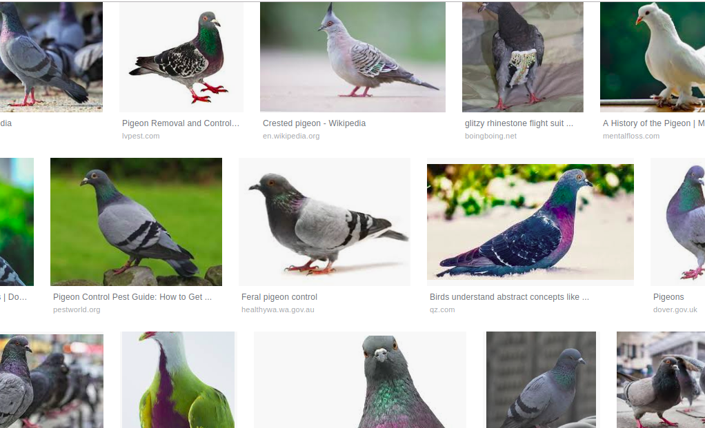

# CREATE A WEBSITE

Build a static (front-end only) website for a charity who advocate for the welfare of wild birds, with this particular site focusing on feral pigeons. As a starting point, you may want to use wireframes.

The charity, Wild Bird Welfare Ireland, would like to create an educational website aimed both at the general public and teachers with myth-busting facts about feral pigeons and their welfare. 

- The main purpose of the site is to raise awareness of pigeon welfare by educating the public with fun facts. 
- The main target audience, apart from the general public and animal lovers, is teachers in schools who could use the information packs for fun and educational activities with their students.
- A secondary purpose is to recruit volunteers and supporters. 

- The charity has been given a government grant to distribute information packs and "I love feral pigeons stickers". Users of the site should be able to apply to have an information pack sent to them. 
- Users should also be able to contact the charity to express interest in volunteering with the charity, for example by helping with a pigeon census of their area.
- Users should be able to follow the charity on social media eg. Facebook, twitter.

The charity has provided you, the developer, with the following assets that they would like to showcase on their website:
- Photos of pigeons
- A video clip
- Audio clips
- Text with fun facts about pigeons
- A day in the life of a pigeon timeline text

# UX Process

## 1. Strategy
- The main purpose of the site is to raise awareness of pigeon welfare by educating the public with fun and interesting facts. 
- The main target audience, apart from the general public and animal lovers, is teachers in schools who can use the information packs for fun and educational activities with their students.
- A secondary purpose is to recruit volunteers and supporters, and spread the topic on social media. 

### Business Objectives and User Needs
The business objectives are to educate and publicise feral pigeon welfare issues. The user needs are for interested parties to learn the facts in a fun way, and to order educational materials and show their support with stickers and social media.

## 2. Scope
### Functional Requirements
- Users should be able to view images and text with facts about pigeons (gallery/facts/timeline)
- Users should be able to contact the charity to order an info pack (contact form).
- Users should be able to apply to volunteer with the charity (form).
- Users should be able to listen to clips of pigeon sounds and view videos (audio/video players).
- The website should be accessible on mobile devices as well as desktops.

### Content Requirements
- Pigeon Photos
- Pigeon Video
- Audio Clips
- Contact Details
- Text for the facts section
- Text for the timeline section
- Text for the About us page
- Social media information (Facebook, Twitter, YouTube)

Facts info collated from:
- https://www.discoverwildlife.com/animal-facts/birds/feral-pigeon-flying-rat-or-urban-hero/
- https://www.pigeoncontrolresourcecentre.org/html/about-pigeons.html#about1

## 3. Structure
### Interaction Design
Will follow best practice in usability. Nielsen's 10 Heuristics.

### Information Architecture
- Home Page (intro, CTA to facts)
- Facts page with timeline in the sidebar - day in the life of a pigeon
- Info Pack CTA (request an info pack and stickers)
- Listen/Watch Page (listen to clips, watch videos)
- Volunteer with us (form)
- About Us Page (basic info on the charity)

## 4. Skeleton
### Wireframes

#### Desktop

#### Mobile
TODO

## 5. Surface
### Branding/ Typography/ Look and Feel
The branding, colours and typography should be appealing and fun, but professional, and give a sense of the beauty of the common pigeon. Here is a selection of imagery presented as a moodboard to get some inspiration for colours and typography:

